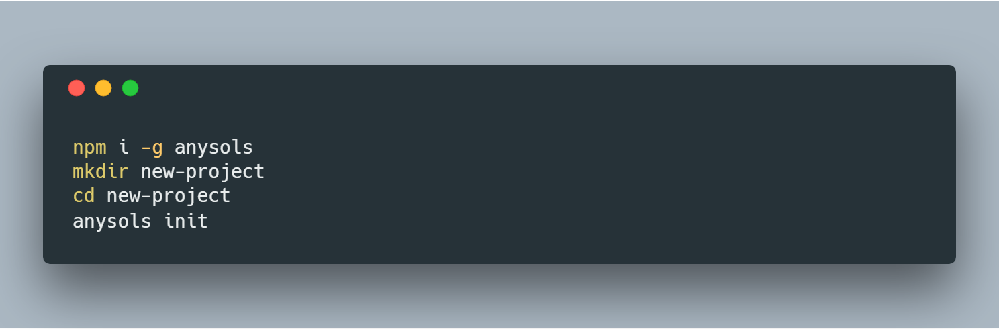

<p align="center">
  <a href="https://anysols.com">
    
  </a>

  <h3 align="center">Anysols</h3>

  <p align="center">
    Sleek and powerful platform for faster and easier application development.
  </p>
</p>

**Master**  
[](https://travis-ci.org/anysols/anysols) 
[](https://coveralls.io/github/anysols/anysols?branch=master)
[](https://www.codefactor.io/repository/github/anysols/anysols)

**Dev**  
[](https://travis-ci.org/anysols/anysols) 
[](https://coveralls.io/github/anysols/anysols?branch=platform)

## Prerequisites
* Install nodejs  (version 8.9.4)  
https://nodejs.org/en/download/

* Install npm

* Install mongodb  
https://www.mongodb.com/download-center?#community

## Setup


## Run
`Note: Check db config in anysols-config.js before running the application.`

```cmd 
anysols
```

browser [http://localhost:8080](http://localhost:8080)

## Code of Conduct
[Contributor Covenant](/CODE_OF_CONDUCT.md)

## License
[Apache License 2.0](/LICENSE)
